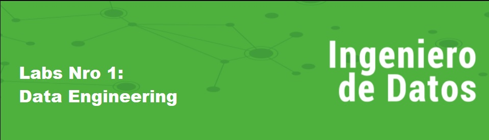
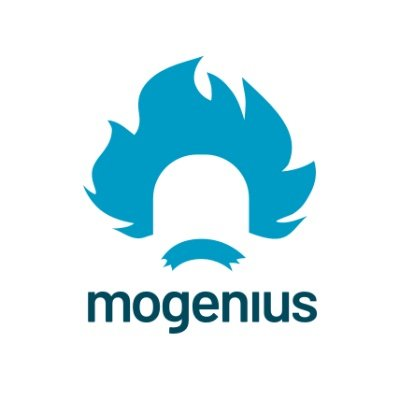

# <h1 align=center> **PROYECTO INDIVIDUAL Nº1** </h1>

# <h1 align=center>**`Data Engineering`**</h1>

## **Introducción**

Este proyecto esta dedicado al desarrollo de una `Application Programming Interface` (API), que es una interfaz que permite que dos aplicaciones se comuniquen entre sí, independientemente de la infraestructura subyacente. Son herramientas muy versátiles y fundamentales para la creación de, por ejemplo, pipelines, ya que permiten mover y brindar acceso simple a los datos que se quieran disponibilizar a través de los diferentes endpoints, o puntos de salida de la API. Para ello se utilizó **FastAPI**, un web framework moderno y de alto rendimiento para construir APIs con Python.

## **Pasos del proyecto**

1. Ingesta y normalización de datos  

Mediante pandas, librería de Python especializada en la manipulación y el análisis de datos, se cargaron en Dataframes los archivos de diferentes fuentes, se limpiaron los datos que presentaban problemas y se le dió el tipo de objeto correcto a las columnas. Se consideró que la duración de los items que tenian NULL fue 0, ya que no tenía sentido aproximarlo a la media, mediana ni MODA en el marco de desarrollo. El resto de datos ausentes se lleno como "Sin datos".

2. Elaboración de la API y relación de tablas 

Utilizando FastAPI, se diseña el home en un ambiente HTML para facilitar las consultas del usuario, importando los dataframes trabajados del scrip "dataframe". Se relacionan las tablas mediante la ingesta de variables por parte del usuario en las consultas:
 
 • get_max_duration(año, plataforma, tipo)  
 • get_count_plataform(plataforma)  
 • get_listedin(genero)  
 • get_actor(plataforma, anio)  

3. Creación de archivo tipo docker para virtualizar, especificando contenedor, librerias y puerto.

4. Deployment en Mogenius

https://pi01-prod-labhenry-rj0v5w.mo6.mogenius.io/
 

**`Repositorio`**

+ https://github.com/ronalcabrera/PI01_DATA05

**`Video demostrativo`**

+ https://www.youtube.com/watch?v=uFJO51zO0Lw

